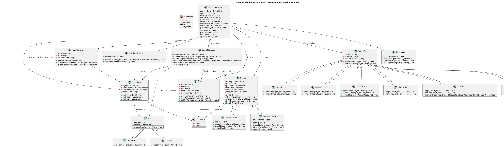

---

# Software Requirements Specification (SRS)

## Maze of Shadows

### Group Number: 6

**Group Members:**  
Logan Falkenberg ([llf46@txstate.edu](mailto:llf46@txstate.edu))  
Farrah Omar ([xwo6@txstate.edu](mailto:xwo6@txstate.edu))  
Bradley Hayes ([blh197@txstate.edu](mailto:blh197@txstate.edu))  
Collin Reisman ([jps191@txstate.edu](mailto:jps191@txstate.edu))  

---

## Table of Contents

1. [Introduction](#1-introduction)  
    1.1 [Purpose of the SRS](#11-purpose-of-the-srs)  
    1.2 [Problem Statement](#12-problem-statement)  
    1.3 [Intended Audience and Document Conventions](#13-intended-audience-and-document-conventions)  
    1.4 [Product Scope](#14-product-scope)  
    1.5 [References](#15-references)  
2. [Functional Requirements](#2-functional-requirements)  
    2.1 [Procedural Maze Generation](#21-procedural-maze-generation)  
    2.2 [Lighting and Visibility Mechanics](#22-lighting-and-visibility-mechanics)  
    2.3 [Enemy Behavior and AI Pathfinding](#23-enemy-behavior-and-ai-pathfinding)  
    2.4 [Power-ups and Item Collection](#24-power-ups-and-item-collection)  
    2.5 [Game Interface and User Interaction](#25-game-interface-and-user-interaction)  
    2.6 [UML Diagrams](#26-uml-diagrams)  
3. [Non-Functional Requirements](#3-non-functional-requirements)  
    3.1 [Performance](#31-performance)  
    3.2 [Security](#32-security)  
    3.3 [Usability](#33-usability)  
    3.4 [Maintainability](#34-maintainability)  
4. [Design and Implementation Constraints](#4-design-and-implementation-constraints)  
    4.1 [Standards Compliance](#41-standards-compliance)  
    4.2 [Development Constraints](#42-development-constraints)  
5. [References and Sources of Information](#5-references-and-sources-of-information)  

---

## 1. Introduction

### 1.1 Purpose of the SRS
The purpose of this Software Requirements Specification (SRS) document is to outline the functional and non-functional requirements for **Maze of Shadows**, a 2D top-down rogue-like maze game developed in Unity. This document will serve as a reference for the development team, providing clear guidance on the game’s expected functionality, design constraints, and usability expectations.

### 1.2 Problem Statement
Many maze-based games offer straightforward gameplay but lack suspense and immersive mechanics. **Maze of Shadows** enhances traditional maze-solving with **dynamic lighting, intelligent enemy AI, and strategic power-ups**, creating a **tense and engaging experience**. The combination of procedural maze generation and survival elements ensures a unique playthrough every time, offering replayability and challenge.

### 1.3 Intended Audience and Document Conventions
This document is intended for:
- The **development team** responsible for implementing the game in Unity using C#  
- **Course instructors** and evaluators reviewing the project for grading  
- **Game testers** who will provide feedback during iterative development  

The document follows **IEEE 830-1998** standards, ensuring clear organization and specification of software requirements.

### 1.4 Product Scope
**Maze of Shadows** is a **single-player** rogue-like maze game featuring:
- **Procedural maze generation** ensuring unique layouts in every playthrough.
- **Dynamic lighting mechanics**, restricting player vision to a small radius.
- **Enemy AI with pathfinding** that hunts and reacts to the player.
- **Item collection system**, requiring players to gather essential items to escape.
- **Power-ups**, such as night vision and an exit finder, to assist player survival.
- **An intuitive UI** for player controls and in-game feedback.
- **Desktop (Windows & Mac) compatibility**, developed in Unity.

### 1.5 References
- **IEEE 830-1998** Software Requirements Specification Standards  
- **Unity Documentation** ([https://docs.unity3d.com/](https://docs.unity3d.com/))  
- **C# Scripting for Unity** ([https://learn.microsoft.com/en-us/dotnet/csharp/](https://learn.microsoft.com/en-us/dotnet/csharp/))  

---

## 2. Functional Requirements

### 2.1 Procedural Maze Generation
- The game generates a **unique maze** for every new playthrough.
- The maze consists of walls and paths that create a solvable puzzle.
- The maze layout supports **pathfinding algorithms** for both enemies and power-ups.

### 2.2 Lighting and Visibility Mechanics
- The **player’s visibility** is limited to a small radius around their character.
- The **exit finder power-up** provides a temporary vision boost.
- Certain **power-ups or environmental effects** may adjust light radius.

### 2.3 Enemy Behavior and AI Pathfinding
- Enemies spawn in various locations within the maze.
- Enemies either **patrol** or **actively chase the player** upon detection.
- AI uses a **pathfinding algorithm** (such as A*) to navigate the maze.
- Some enemies may have different behaviors (e.g., fast but short-ranged, slow but persistent).

### 2.4 Power-ups and Item Collection
- Players must collect **specific items** before reaching the exit.
- Items will be **randomly placed** but always accessible via a valid path.
- Available power-ups include:
  - **Exit Finder**: Guides players towards the exit or required items.
  - **Night Vision**: Temporarily increases visibility radius.
  - **Health Boost**: Restores player health if damaged.

### 2.5 Game Interface and User Interaction
- Players control movement using **WASD or arrow keys**.
- A **HUD (heads-up display)** shows collected items, health, and power-ups.
- A **mini-map (if implemented)** provides limited directional guidance.

### 2.6 UML Diagrams
To better illustrate the system’s functional architecture, the following UML diagrams are provided:
- **Use-Case Diagram** – Displays how users (players) interact with the game system.
- **Class Diagram** – Represents the structure of major classes and their relationships.
- **Sequence Diagram** – Outlines interactions between the player, enemies, and game systems.

**UML Diagram File:**  
  

---

## 3. Non-Functional Requirements

### 3.1 Performance
- The game should **run smoothly at 60 FPS** on modern mid-range PCs.
- **Maze generation time** should be under **3 seconds**.

### 3.2 Security
- No online components, so **security concerns are minimal**.
- Save files (if applicable) should be protected against corruption.

### 3.3 Usability
- Controls should be **simple and intuitive**.
- Difficulty should **scale appropriately** to avoid frustration.
- The UI must be **clear and readable**.

### 3.4 Maintainability
- The game will use **modular code**, making it easy to update.
- Power-ups and enemies should be **easily expandable** in future iterations.
- A **version control system (GitHub)** will be used for collaboration.

---

## 4. Design and Implementation Constraints

### 4.1 Standards Compliance
- The game follows **IEEE 830-1998** SRS standards.
- Unity development adheres to best practices outlined in **Unity’s documentation**.

### 4.2 Development Constraints
- The game must be completed within the semester.
- Team members have **varying experience levels** with Unity and C#.
- The scope must be feasible given available time and resources.

---

## 5. References and Sources of Information
1. IEEE 830-1998 SRS Documentation  
2. Unity Documentation: [https://docs.unity3d.com/](https://docs.unity3d.com/)  
3. C# Scripting in Unity: [https://learn.microsoft.com/en-us/dotnet/csharp/](https://learn.microsoft.com/en-us/dotnet/csharp/)  
4. A* Pathfinding Algorithm Reference: [https://www.redblobgames.com/pathfinding/a-star/](https://www.redblobgames.com/pathfinding/a-star/)  

---
